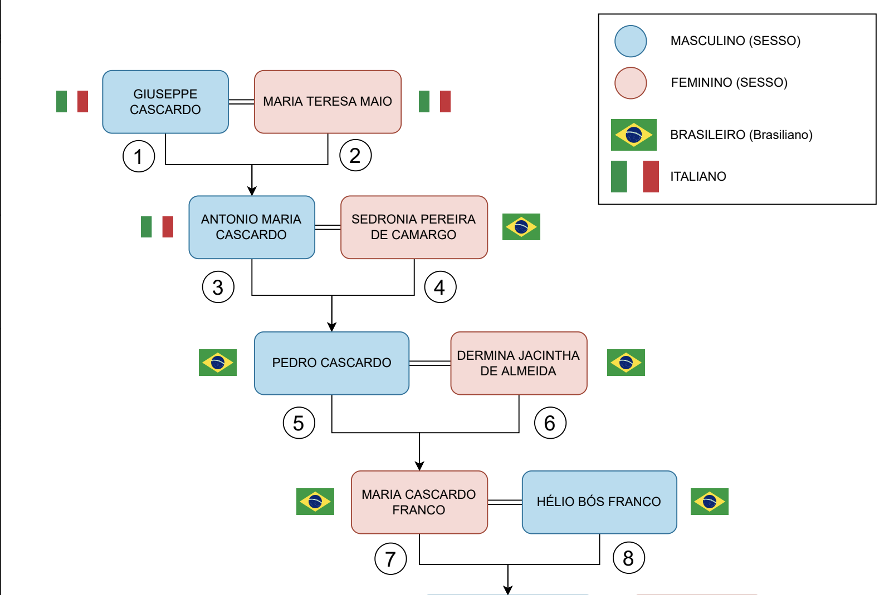

# Cidadania Italiana :it:
Este documento tem como objetivo descrever alguns passos para a aquisição da cidadania italiana. As informações aqui apresentadas são baseadas no autoconhecimento e na experiência que obtive ao fazer o processo de cidadania italiana para a minha família. Algumas partes do processo podem mudar dependo do seu caso. 

Com a experiência obtida na aquisição da cidadania diretamente aqui na itália, percebi que muitas pessoas mal intencionadas (inclusive brasileiros que se dizem consultores) aproveitam da falta de conhecimento do processo e a dificuldade de falar o italiano para vender uma consultoria extramamente cara e sem nenhuma garantia.

__Não sou consultor e nem vendo nenhum serviço relacionado a cidadania, mas deixo aqui todas as informações que obtive durante o processo, como objetivo de auxiliar outros brasileiros a conseguir a sonhada cidadania.__

### :speech_balloon: Telegram

Afim de acelerar a comunicação entre Brasileiros e pessoas que ja fizeram ou pretender fazer a cidadania, montamos um grupo no Telegam para compartilhar informações e ajudar as pessoas em seus processos. 

__Observação:__
- O grupo é privado por questões de segurança, então você precisa solicitar para participar.
- O grupo não tem objetivo de vender qualquer serviço relacionado a cidadania e sim compartilhar informações e ajudar as pessoas na obtenção da cidadania italiana.

__Link do Telegram__

https://t.me/+nTcZejSfpBAyZGYx


## :interrobang: Por onde começar?

A dúvida de muitos é por onde devemos começar para conseguir a cidadania italiana.

Existem várias maneiras de obter a cidadania italiana. A cidadania italiana é regida pela lei Jus Sanguinis, o que significa "direito de sangue", e, portanto, muitas vezes pode ser obtida através da linhagem ou ascendência. As maneiras mais comuns de se obter a cidadania italiana incluem:

1. **Por descendência**: Se você tem antepassados italianos, pode ter direito à cidadania italiana. Isso geralmente requer que você comprove sua linhagem com documentos apropriados, como certidões de nascimento e de casamento.

2. **Por casamento**: Se você se casar com um cidadão italiano, pode ter direito à cidadania italiana. No entanto, este é um processo que pode levar alguns anos e requer que você viva na Itália durante esse tempo.

3. **Por naturalização**: Se você morar na Itália por um certo período de tempo (geralmente 10 anos para não europeus, 4 anos para cidadãos de outros países da UE e 5 anos para refugiados ou apátridas), pode solicitar a cidadania italiana.

4. **Por adoção**: Se você for adotado por cidadãos italianos, pode ter direito à cidadania italiana.

5. **Por serviço à Itália**: A cidadania italiana também pode ser concedida a estrangeiros em reconhecimento a serviços prestados à Itália ou se a Itália considerar que sua cidadania seria benéfica para o país de alguma forma.

6. **Nascimento na Itália**: Se você nasceu na Itália e reside lá até os 18 anos, pode optar por obter a cidadania italiana.


__Aqui iremos descrever nossa experiência na obtenção da cidadania italiana por descendência (item 1)__


#### Antepassados Italianos

Se você possui antepassados italianos, o primeiro passo é levantar o máximo de informações que leve até a origem do seu antepassado.

Para isso tente falar com seus parentes ou conhecidos para descobrir o local de nascimento de seu atepassado ou até mesmo utilize sites como [Family Search](https://www.familysearch.org/pt-br) para obter informações.

Você tambem pode ir até o cartorio e solicitar uma certidão de inteiro teor, como casamento, óbito ou outras que obtenham alguma informação que o ajude a descobrir a origem de seu antepassado na italia.

__Árvore Genealógica__

Para facilitar na compreensão e na montagem de um checklist de toda a documentação necessária, monte um gráfico(organograma) da sua árvore genealógica, começando do ancestral italiano até você.

A árvore genealógica não é obrigatória, mas irá te auxiliar na organização e no entendimento da linhagem e na montagem da sua pasta de documentos, que irá ter certidões de nascimento, casamento e óbito (em caso de antepassados falecidos).

*Exemplo:*




__Certidão de Nascimento - Ancestral Italiano__

Com todas as informações em mãos sobre onde nasceu seu antepassado italiano que te concede o direito a cidadania, é hora de conseguir um cópia da certidão de nascimento. 

Essa etapa pode ser um pouco mais dificil, pois alguns italianos tem suas certidões registradas em comunes e alguns até me igrejas. Mas não desanime. Você pode enviar um e-mail a comune(digamos que é a prefeitura da cidade em que nasceu seu antepassado) solicitando informações e se por acaso a certidão de nascimento se encontra naquela comune.

Um ótima dica é utilizar o "ChatGPT", para escrever sua mensagem em português e pedir que ele traduza para o italiano e modifique sua mensagem de forma que seja cordial sua solicitação.

Exemplo a ser digitado no ChatGPT:

```
 Escreva uma mensagem em italiano de forma cordial, para que a pessoa da comune que receber a mensagem possa verificar se a certidão de nascimento do meu antepassado italiano [NOME DO ANTEPASSADO] existe ou esta registrada nesta comune.
```

Resposta:

```
Caro Signore o Signora,

Mi chiamo [SEU NOME] e spero che questa email la trovi in buona salute. Mi permetto di scriverLe in merito ad una ricerca genealogica che sto attualmente svolgendo. Sto cercando di tracciare le radici della mia famiglia e ho scoperto che un mio antenato, [NOME DO ANTEPASSADO], potrebbe essere nato nel vostro comune.

Secondo le informazioni che ho raccolto, [NOME DO ANTEPASSADO] è nato in Italia il [DATA DE NASCIMENTO]. Sarei molto grato se poteste gentilmente verificare se esiste un atto di nascita corrispondente a questo nome e data nella vostra registrazione civile.

Capisco che siete molto occupati e apprezzo sinceramente il tempo e l'attenzione che dedicherete a questa richiesta. Vi pregherei di farmi sapere se ci sono eventuali costi associati per questo servizio o se ci sono ulteriori informazioni di cui avete bisogno per effettuare la ricerca.

Grazie mille per la vostra cortese attenzione. Attendo con ansia una risposta da parte vostra.

Cordiali saluti,

[SEU NOME]
[SEU ENDEREÇO DE E-MAIL]
[SEU NUMERO DE TELEFONE]

```